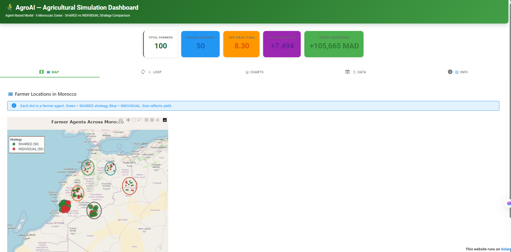

# FarmSwarm: Network-Based Collective Intelligence for Smart Agriculture

An agent-based model (ABM) built with [Mesa](https://mesa.readthedocs.io/) that simulates farmer decision-making across Morocco's agro-ecological zones. The simulation compares **cooperative (SHARED)** and **individual (INDIVIDUAL)** farming strategies using real-world data from FAO, Copernicus, and NASA POWER.



## Research Question

> Does cooperative knowledge-sharing between farmers improve crop yields and profitability compared to individual decision-making?

## Key Features

- **100 paired agents** (50 SHARED + 50 INDIVIDUAL) across 6 agro-ecological zones
- **24 crops** with FAO EcoCrop suitability and FAOSTAT pricing
- **Real cost model**: labor (SMAG × days/ha) + fertilizers (NPK by category) + seeds (by category) + mechanization (by category) + water (zone-specific tariffs × crop needs)
- **Climate data**: NASA POWER temperature and precipitation per zone
- **Soil moisture**: Copernicus C3S root-zone soil moisture
- **Social network**: NetworkX-based knowledge propagation (small-world, random, scale-free)
- **Interactive dashboard**: Solara web interface

## Quick Start

```bash
pip install -r requirements.txt
```


Open `simulation.ipynb` in Jupyter or VS Code. The main simulation parameters are set in the `SIM_CONFIG` dataclass (see the first code cell):

```python
from dataclasses import dataclass

@dataclass
class SIM_CONFIG:
	n_agents: int = 100        # Number of agents (farmers)
	n_seasons: int = 30        # Number of seasons to simulate
	shared_strategy: str = "both"  # 'zone', 'neighbor', or 'both'
	use_neighbor_graph: bool = True
	# ... other parameters ...
```

To change the number of agents, update `n_agents` in the config cell. For example, to run with 200 agents:

```python
cfg = SIM_CONFIG(n_agents=200)
model, df, hist_df = run_sim(cfg)
```

Run all cells to execute the simulation and export results.

Optional — launch the interactive dashboard (from the folder containing `dashboard_solara.py`):

```bash
cd AgorAI
solara run dashboard_solara.py
```

## Project Structure

```
├── simulation.ipynb              # Main simulation notebook
├── dashboard_solara.py           # Solara web dashboard
├── requirements.txt
│
├── data/                         # Input data
│   ├── crops.json
│   ├── zones.json
│   ├── climate_profiles.json
│   └── soil_moisture_profiles.json
│
├── scripts/                      # Data preparation utilities
│   ├── fetch_climate_data.py
│   ├── update_crops_faostat.py
│   └── extract_faostat_prices.py
│
├── Extract_morocco_data.ipynb   # Copernicus NetCDF → soil moisture JSON
├── results/                      # Auto-generated outputs
└── logs/
```

## How It Works

### Crop Selection

Each farmer scores viable crops using ecological suitability (zone, soil, climate, moisture) plus optional bonuses:

- **SHARED**: zone-level yields, neighbor knowledge, own experience
- **INDIVIDUAL**: own suitability and experience only

### Economics

Production costs are calculated per hectare using real Moroccan agricultural data:
- **Labor**: SMAG minimum wage × crop-specific labor days per hectare
- **Fertilizer**: NPK costs by crop category (cereals, legumes, vegetables, etc.)
- **Seeds**: Seed costs by crop category
- **Mechanization**: Equipment costs by crop category
- **Water**: Zone-specific tariffs × crop water requirements

SHARED farmers get +20% price premium, 30% cost reduction, and 5% post-harvest loss vs 15% for individuals. Profit = `(yield × price − total_cost) × land_size`.

### Learning

After each season, SHARED farmers update zone-level knowledge and propagate results through the social network. Over 30 seasons, cooperative strategies converge on better crop choices.

## Configuration

Parameters are defined in the `SIM_CONFIG` dataclass inside the notebook. Key settings: `n_agents`, `n_seasons`, `shared_strategy`, `use_neighbor_graph`, suitability weights, and cooperative economics.

## Data Sources

| Dataset | Source |
|---------|--------|
| Crop suitability & ecological requirements | FAO EcoCrop Database |
| Crop prices | FAOSTAT Producer Prices (Morocco, 2024) |
| Labor costs | Morocco SMAG (Minimum Agricultural Wage, Decree 2.23.993) |
| Fertilizer costs | OCP Group domestic prices |
| Seed costs | SONACOS Morocco seed market prices |
| Mechanization costs | Regional agricultural cooperatives survey data |
| Water tariffs | ORMVA (Offices Régionaux de Mise en Valeur Agricole) |
| Climate data | NASA POWER temperature and precipitation |
| Soil moisture | Copernicus C3S root-zone soil moisture |
| Zones & agricultural data | Morocco agricultural ministry data |

## References

**Framework**

- Mesa: Kazil, J., Masad, D., & Crooks, A. (2015). Mesa: An Agent-Based Modeling Framework. *SciPy Proceedings*. https://doi.org/10.25080/Majora-7b98e3ed-009

**Data**

- FAO EcoCrop: Ecocrop Database, FAO. http://ecocrop.fao.org/ecocrop/srv/en/home
- NASA POWER: NASA Langley Research Center, Prediction Of Worldwide Energy Resources (POWER) Project. https://power.larc.nasa.gov/
- Copernicus C3S Soil Moisture: Soil moisture gridded data from 1978 to present. Climate Data Store. https://cds.climate.copernicus.eu/datasets/satellite-soil-moisture

## Data Preparation

Scripts in `scripts/` were used to build the JSON files in `data/`. Re-run only when updating source data:

```bash
python scripts/fetch_climate_data.py --start 1991 --end 2020
python scripts/update_crops_faostat.py
```

Copernicus soil moisture: see `Extract_morocco_data.ipynb`.

## Troubleshooting

| Issue | Solution |
|-------|----------|
| `ModuleNotFoundError` | Run from project root; restart kernel |
| Dashboard won't start | `pip install solara solara-plotly` |
| Missing data | Ensure all `.json` files exist in `data/` |

## License

See [LICENSE](LICENSE).
